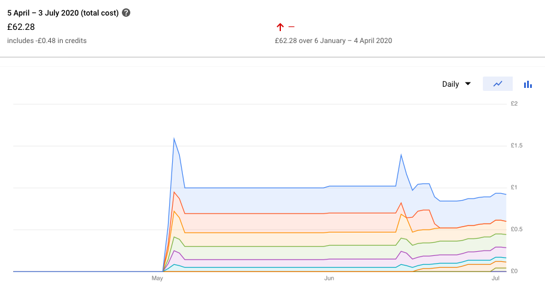

# Running quorum on preemptible GCP instances aka 'consortia ledger on the cheap'

## Intro

Run a cloud hosted 'consortia' style private dlt for less than £50 per month.
The deploymenent is aimed at developers wanting exposure to 'production'
tools & techniques without imposing 'production' costs (time and money)

Inspired by and extending [k8s for cheap on google cloud](https://dev.to/verkkokauppacom/how-to-kubernetes-for-cheap-on-google-cloud-1aei)

What can you do with this ? Operate your own CaaS (Contracts As A Service) ala

* https://medium.com/getamis/sol2proto-694af65ded55
* https://medium.com/getamis/grpc-in-dapp-architecture-8c34125356c7
* https://medium.com/@deeptiman/protobuf-in-hyperledger-fabric-eb674ba9ebd8

By spreading our dlt nodes around a cluster of pre-emptible virtual machines we
can get a reliable service on top of "cheap" un-reliable resources.

## What - overview

* quorum deployment with raft consensus and optional tessera (private transactions),
  with support for addition and removal of nodes at will.
  * raft is convenient and simple and scales 'enough' for development and small
    networks.
  * might leave tessera as follow up article.
* wallet keys held in GCP security-manager secrets access controled using GCP
  principals.
  * using Cloud KMS (hsm) backed key to wrap the secrets is possible but a
    *lot* more expensive and requires custom 'unwrap' code on the nodes
  * can't avoid node keys on disc (clef can fix this?), but can make it
    transitory and ram based
  * could (probably) avoid wallet keys on disc - or at least puting them on
    disc ourselves - but its more work. currently, and this is normal when
    using go-ethereum based clients - clients all sign and send raw tx's. don't
    think clef is compatible with this.
* Use of Google Cloud NAT, Workload Identity, Secrets Manager
* Use of kubeip and traefik for ingress to web access layer workloads
  * it is questionable whether kubeip is the right solution, it results in
    'un-assigned' ip pricing (>10x expensive but still only 24 cents/day). May
    be able to achieve the same results by simply assigning the ip to the
    ingress instance in the tf config - and lose kubeip altogether.
  * update my cost breakdown shows the static ip is the 2nd most expensive
    item. it is *more* expensive than some of my vm instances
* go-ethereum service exposing contract functions as rest endpoints (hello CaaS)
* terraform cloud hosted and git controled cluster configuration.
* kubernetes pod authorisation using k8s service accounts bound to GCP
  principals using workload identity
  principals for kubernetes pod authorisation
* blob (bucket) storage for dlt configuration (genesis and static-nodes.json)
* blob (bucket) storage for tracking deployed contracts and their abi's
* skaffold for build/deploy/test

## Key modifications from referenced 'cheap cluster' article
* use workload identity for kubeib
* use strategy 'replace' for traeffic - rolling update can't possible work with how the node taints are setup

## How to stand up the cluster - fast

Section for reader that wants to stand up the cluster and dlt as well as read
about it. checkout -> operational as directly as possible.

### cluster
* fork
* google cloud project setup
* tf cloud setup
* git commit
* make coffee - tada!

### Auth bootstrap (dev cli)

auth bootstrapping

    gcloud init (to set all the defaults)
    gcloud container clusters get-credentials kluster
    gcloud auth application-default login

### Skaffold gotchas

* default setup almost just works. traefik taints only permit one instance so the
  replacement is stuck pending until the old instance is manually deleted.
* kubectl deployment needs extra work (or can't handle) dependence on customer
  resource definitions or definition order dependencies
  [order of manifest respected since aug 2019](https://github.com/GoogleContainerTools/skaffold/pull/2729)
* --force allows skaffold to replace resource
* patch

## Zero Cost at Idle (close as possible)

This may not be perfectly realizable. This is a list of things that affect it.

* Non-assigned static IP address are 10x more expensive than assigned.
  * If assigned by kubeip they are 'un-assigned' when the workload is deleted
  * If assigned to a vm instance they are 'un-assigned' whent the vm instance
    is deleted (cluster delete)
* PersistentVolumeClaim reclaim policy
  * For chain data this should really be Retain, but it will be retained after
    cluster deletion and that is >0 charge
* dns names if using

## Network - routing geth nodes

The options for 'cheap' routing of consortum nodes are not great.  Allocating
dns names and ip addresses for every geth node would be expensive and a lot of
work. And there are plenty of guides out there focused on that sort of thing.

Arranging to expose the geth nodes on different ports on the same ip/dns name
is possible. But the resulting configuration isn't very realistic. With
quorum's 2.4.0 release dns names are supported for the nodes declared in the
'static nodes' configuration file. Using dns names to reference the nodes makes
it *look* like a public internet in a lot of places. And that is probably
enough for most realistic personal development scenarious.

TODO:

* static un-assigned ip address are way more expensive than assigned ones.
  kubeip might not be the best solution - but its still only 0.24 cents / day
* just assigning it to the ingress vm instance looks like the same effect and
  a lot less faff

We get a 'custom' [VPC Overview](https://cloud.google.com/vpc/docs/overview)

Point out how bits of the terrafor network configuration map to VPC

Consider Shared VPC for 'genesis' node

VPC Network Peering is the answer for SaaS and inter organisational
collaboration.

Hybrid cloud Cloud VPN is for self hosted *and* on-prem nodes

## Kubernetes Workloads

### Identity and Authorization

* anoyingly, workload-identity is currently incompatible with isio side car
  injection (at least without customisation)
* [Google - Workload Identity](https://cloud.google.com/kubernetes-engine/docs/how-to/workload-identity)

The workspace-identity terraform modules create k8s service accounts with:

    automountServiceAccountToken: false

This is the secure default. pod's can set this explicitly if they need it. The
kubeip pod needs it. Once this is done, worload identity just works. No need
for GOOGLE_APPLICATION_CREDENTIALS or fetching tokens or epxlicitly managing
keys in secrets

Note it turns out that the google sdk client libraries "DefaultClient"
implementation are workload identity aware. Provided other established
mechanisms, such as GOOGLE_APPLICATION_CREDENTIALS, are not configured then it
falls through to just asking the metadata server for a token - at which point
it gets one.

test workload identity config:

    kubectl run -it \
      --generator=run-pod/v1 \
      --image google/cloud-sdk:slim \
      --serviceaccount quorum-node-sa \
      --namespace default workload-identity-test
    gcloud auth list

It will show the kluster-serviceaccount as the active account:

    kubectl run -it --generator=run-pod/v1 --image google/cloud-sdk:slim --serviceaccount quorum-node-sa --namespace default workload-identity-test
    gcloud auth print-identity-token

Get acccess token using curl:

    apt-get update && apt-get install jq -y
    TOKEN=$(curl -s -H 'Metadata-Flavor: Google' http://metadata/computeMetadata/v1/instance/service-accounts/default/token | jq -r .access_token)

Download:

    curl -H "Authorization: Bearer $TOKEN" https://storage.googleapis.com/storage/v1/b/quorumpreempt-cluster.g.buckets.thaumagen.com/o/hello.txt?alt=media

Upload:

    echo "hello workload" > hello.txt
    curl -X POST --data-binary @hello.txt \
        -H "Authorization: Bearer ${TOKEN}" \
        -H "Content-Type: text/plain" \
        "https://storage.googleapis.com/upload/storage/v1/b/quorumpreempt-cluster.g.buckets.thaumagen.com/o?uploadType=media&name=hello.txt"

### Secrets

Terraforms posture on secret data in statefiles is [Stupid](https://github.com/hashicorp/terraform/issues/516)

Terraform cloud's posture is [Better](https://www.terraform.io/docs/state/sensitive-data.html) but far from ideal

With Google Secrets Manger the 'secret' and its 'version' are seperate things.
The 'version' is the current value of the 'secret'. IAM policies are applied to
the 'secret'. So, Use terraform to create the secret but use cli to set the
version version (current value) - that way tf never sees the secret data at all
but we can still use tf to manage the iam's for the secret

But note that the tfstate has credentials to access the whole project so its
still not a complete 'package'. Keys wrapped via Cloud KMS are probably the
'belt and braces' answer but that is too much cost & work for a developer
focused setup.

Dev guides [Google - Secret Manager](https://cloud.google.com/solutions/secrets-management#tools)

Using with terraform [Terraform and Secret Manager](https://www.sethvargo.com/managing-google-secret-manager-secrets-with-terraform/)

Note that we _do not_ create the secret with terraform as that exposes the
plain text in the state file. terrafor cloud encrypts that at rest but its
still not great.

### Storage for chain nodes

* persistent disc on vm for chain data
* persistent disc on vm for tessera db (anything else is $$$)
* blob storage in bucket for genesis, network membership (static-nodes) and
  node config.

### Resources - Perstent Volumes, StatefulSets, Istio (StatefulSets not really supported)

* [Google Cloud, PersistentVolumeClaim](https://cloud.google.com/kubernetes-engine/docs/concepts/persistent-volumes)
* [Google Cloud, StatefulSet](https://cloud.google.com/kubernetes-engine/docs/concepts/statefulset)

Reclaim policy to retain after claim gone ? [k8s pv reclaim policy](https://kubernetes.io/docs/tasks/administer-cluster/change-pv-reclaim-policy/)
This has to be done by directly modifying the Persistent Voluem *after* it has
been provisioned. See [change reclaim policy on a dynamically provissioned volume](https://kubernetes.io/blog/2017/03/dynamic-provisioning-and-storage-classes-kubernetes/)

> StatefulSets use an ordinal index for the identity and ordering of their
> Pods. By default, StatefulSet Pods are deployed in sequential order and are
> terminated in reverse ordinal order
-- [Google Cloud, StatefulSet](https://cloud.google.com/kubernetes-engine/docs/concepts/statefulset)

Parallel should be fine, although the default OrderedReady may be more
convenient it encourages un-necessary order dpendency.

It may prove tempting to use a Deployment and ReadWriteOnce with a single node.
This isn't a reliable configuration. See [Google - Deployment vs StatefulSets](https://cloud.google.com/kubernetes-engine/docs/concepts/persistent-volumes#deployments_vs_statefulsets)

A StatefulSet with a single replica is the right choice for scenarious where a
single helm deployment equates to a single dlt node.

Without Istio in play, our setup enables use of kubectl scale to dynamicaly
increase the node count.

updateStragety (statefulset)

For RollingUpdate a onfig change starts a new pod. The old pod is only deleted
once the new one is up and ready.

??? If the new pod is re-using the node key of the old this will/will not work ?

For OnDelete, a manual pod deletion triggers a new pod to be created.

??? Individual node key delivery to pods in stateful set ?

Istio users beware, istio has ambigious (at best) support for StatefulSet
applications. In short, if the nodes are *NOT EXTERNALY EXPOSED* then it is
possible to have them 'in mesh' without much trouble. If the are to be routable
accross the open internet, it is still possible, but explicit istio
configuration needs to be created for each scaled instance of the StatefulSet.

If external clients usage is agnostic to which quorum instance they talk
to, it is actually ok to let istio lb the traffict. This works pretty well
until tessera is added - at which point using raw transactions (as go-ethereum
clients do) make things quite hairy. The tx needs to be submited first to
tessera then its hash presented to quorum in a seperate request. There are ways
to make it rare that those request pairs will reach different services but it
will still happen.

And tessera instances MUST be able to reliably reach specific peers else they
will refuse to ACK transactions.

This article on casandra has the key points layed out very well
if using ClusterIP: None (headless) and where only internal routing is required
(No north/south from external sources)

[Cassandra / Istio Article](https://aspenmesh.io/running-stateless-apps-with-service-mesh-kubernetes-cassandra-with-istio-mtls-enabled/)
* Congigure container processes (qurorum) to listen on local host (despite
    recording externaly visible ip/hosts in static-nodes.json)
* REMOVE/DON'T ADD ServiceEntry's or VirtualService definitions
* For ClusterIP: None, the default load balancing mode is PASSTHROUGH

This article covers North/South. Essentially, a manualy, or some how templated,
ServiceEntry, Gateway and VirtualService are required for *each individual pod*
in the statefulset -- this is a problem for using kubectl scale 'on the flye'
[Istio, Headless Services, StatefulSet](https://medium.com/airy-science/making-istio-work-with-kubernetes-statefulset-and-headless-services-d5725c8efcc9)

This will wrap traffic in mTLS. Note that as quorum now supports rpc over tls
this may not be as compelling any more.

[Istio, Headless Services, StatefulSet](https://medium.com/airy-science/making-istio-work-with-kubernetes-statefulset-and-headless-services-d5725c8efcc9)
[Istio ticket statefulset not supported](https://github.com/istio/istio/issues/10659)
[Cassandra / Istio Article](https://aspenmesh.io/running-stateless-apps-with-service-mesh-kubernetes-cassandra-with-istio-mtls-enabled/)

## Secret creation, terraform resource declaration & import

We pre-create a bunch of keys and set the IAM's 'before the show'. Remote State
and a TF project per node offers better granularity but a whole tf project per
node is pretty heavy weight. Pre-creation of 'light weight' resources doesn't
significantly impact our costs and is less faffy

[secret generation support](./Taskfile.yml)

Create the secrets for the nodes. This requires some setup.

See [requirements.txt](./tools/requirements.txt) and particularly
* [Python - google-auth](https://pypi.org/project/google-auth/)
* [Python - google-cloud-secret-manager](https://pypi.org/project/google-cloud-secret-manager/)

XXX: TODO: Sort out a docker image for this (and dind arrangements for linux and mac)

Run:

    gcloud auth application-default login

    scripts/secret.sh nodekey qnode-0
    scripts/secret.sh nodekey qnode-1
    scripts/secret.sh nodekey qnode-2

Create the tf resource in the cluster module

    resource "google_secret_manager_secret" "qnode" {
      for_each = toset([
        "qnode-0-key", "qnode-0-enode",
        "qnode-1-key", "qnode-1-enode",
        "qnode-2-key", "qnode-2-enode" ])
      secret_id = each.key
      replication = automatic
    }

Select appropriate version of beta provider in terraform.tf

    required_providers {
      google-beta = ">= 3.8"
    }

    terraform init  # to update provider if necessary can ommit

Import the secret defintions

    terraform import -provider=google-beta \
        module.cluster.google_secret_manager_secret.qnode-enode[\"qnode-0-enode\"] \
        projects/quorumpreempt/secrets/qnode-0-enode

Now go look at the contents of your tf state and convince yourself that the
(public) enode address is not revlealed

Now import the rest - do both the keys and th enodes now we know the keys wont
get dumped into the tfstate.

    terraform import -provider=google-beta \
        module.cluster.google_secret_manager_secret.qnode-enode[\"qnode-0-key\"] \
        projects/quorumpreempt/secrets/qnode-0-key

    for i $(seq 1 2)
    do
        terraform import -provider=google-beta \
            module.cluster.google_secret_manager_secret.qnode-enode[\"qnode-$i-enode\"] \
            projects/quorumpreempt/secrets/qnode-$i-key
        terraform import -provider=google-beta \
            module.cluster.google_secret_manager_secret.qnode-enode[\"qnode-$i-key\"] \
            projects/quorumpreempt/secrets/qnode-$i-enode
    done

So we need to import the state

[Terraform - Import](https://www.terraform.io/docs/import/index.html)
[Terraform - Import Secret](https://www.terraform.io/docs/providers/google/r/secret_manager_secret.html#import)

init container with service principal auth to get token.
use curl to get secret via api

    TOKEN=$(curl -s -H 'Metadata-Flavor: Google' http://metadata/computeMetadata/v1/instance/service-accounts/default/token | jq -r .access_token)
    curl "https://secretmanager.googleapis.com/v1/projects/quorumpreempt/secrets/qnode-0-key/versions/1:access" \
        --request "GET" \
        --header "authorization: Bearer ${TOKEN}" \
        --header "content-type: application/json"

Note: DO NOT add

        --header "x-goog-user-project: quorumpreempt"

As this requires an oauth2 token with authenticated *user* identity

We store enode address alongside the key for convenience even though it is not
secret - saves faffing with two different storage providers or having to
re-derive the enode addr

The init container gets the key every time - incase it roles. Caches most
recent key on local disc. Two modes of operation:

1. dev - if the key changes, force re-create the node (saving the old node
   dir). maximum convenience for dev, not much risk to chain data
2. prod - if key changes, refuse to start

See also,
* If you can afford it [Google KMS](https://medium.com/kudos-engineering/secret-management-in-kubernetes-and-gcp-the-journey-c76da8de96d8)
* From the makers of kubeip [secrets-init](https://blog.doit-intl.com/kubernetes-and-secrets-management-in-cloud-858533c20dca)
  Integrates with Google Secrets Manager and Google Workload Identity
Glossy [Google - Secret Manager](https://cloud.google.com/secret-manager)

## Protocol Selection (Istio Compatibility) Ports and IP Assignment

If considering adding istio to the mix, port names matter if deploying on k8s <
1.18. [Istio - Protocol Selection](https://istio.io/latest/docs/ops/configuration/traffic-management/protocol-selection/)

In this article, and for the supporting git hub manifest all ports are named
with this in mind

All ports are set consistently with the defaults for the workload service. So
8545 is the json-rpc port for qurourms workload. To support routing to multiple
quorum instances in the same cluster from the public internet through a *single
ip* address we shift the port assignments in blocks of 10. So the first node
has all defaults, the second has default + 10 and so on. This is a cost/ease
concession.

When ip addresses are not assigned, the cost 10x more. And for a developer
focused deployment we expect tearing down workloads and leaving the cluster
idle to be the norm. If ips are persistently assigned to vm instances the idle
costs would be acceptable. But then tearing down the cluster would actually
*increase* our costs over an  idle cluster. Idealy we want tearning down the
cluster to reduce our monthly google bill to zero.

We can the use the magic of terraform cloud to stand everything up again in
'cup of coffee' time frame.

## Quorum

Store config in blobs and re-fetch each time. if config is deleted reset all the nodes but keep 'last ditch backups' on the pv.

Fetch secrets to emptyDir every time and symlink into nodedir

side note on running python in quorum's alpine image. Set PYTHONUNBUFFERED=1
else output is missing or delayed

### Genesis

Store in blob. Re-generate if blob missing. If blob missing ignore disk

### Membership

static-nodes.json store in blob

get key from secret store fresh everytime. get static-nodes.json from blob
every time. store in emptyDir. derive enode from key.  If enode not in
static-nodes (from blob) or blob missing re-initialise. move asside any prior
node dir

"Fatal: failed to find local enode ID" is symptomatic of not having the key in
the node dir. In our case, not having fetched it from secrets manager or having
fetched it and then written it to the wrong place or not at all.

Do not attempt to automatically raft.removePeer.

Lets remind ourselves what we can count on from raft.addPeer and also what is
required of us: http://docs.goquorum.com/en/latest/Consensus/raft/raft-rpc-api/

1. raft.addPeer takes an enode address - public address of the nodes key.
2. It errors with an idenfifiable message if the enode is already a member

   > node with this enode has already been added to the cluster

3. If successful it returns the RAFT_ID
4. raft.cluster returns a json document listing all current members and their
   raft ids
6. The initial nodes in the network must be in static-nodes.json and must be
   listed in the same order on each node.
7. There need only be *one* nodes in static-nodes.json
8. Other nodes can be added and removed later without updating
   static-nodes.json if dynamic peer discovery is enabled.
9. To support joining older chains without compromising consensus, nodes should
   join as learner nodes and be promoted once they have synced.

MVP: For now we chose to fully configure the network in static-nodes.json and
distribute the file via a google cloud bucket object.

BETTER:
* one replica set for 'bootnodes' with principal which permits writting
  genesis and static-nodes.json
* one (or more) replica set(s) for participant nodes with a different principal
* All qnode's attempt to update static-nodes.json. Non boot nodes treat 403 as
  "I know you but you are not allowed to do that" and continue. All nodes use
  raft.cluster to check if they are a member and if not will call raft.addPeer

### Accounts

We do not import accounts, except for development cli convenience use. When
using the go-ethereum generated code bindings all transactions are
eth_sendRawTransaction and so are pre signed by the client. The clients keys
are delivered from google secrets manager to the specific workload. Access is
controled by iam permissions.

For development, it is convenient to be able to import and unlock the genesis
accounts. This lets us use node signing and eth_sendTransaction for
experimentation.

### Resilience in the face of pre-empting

Our VM instances *will* get killed at least once per 24hours. Can we use
https://kubernetes.io/docs/concepts/workloads/pods/pod-topology-spread-constraints/

To spread our geth nodes around ?

### google cloud bucket object generation and metageneration

Instead of leasing, googles model is to get the metadata of the object before
the update/write. Then on write, set a precondition match requirement. The
generation changes every time the object changes. The meta-generaiton changes
everytime the object meta data changes. The meta-generation is *reset* when
the object changes and is only meaningfull in combination with a generation
pre-condition

This works very well for read/modify/write where there are no side effects
*other* than the changed bucket content. However, when there are other
side-effects - for example raft registraion - we need some kind of distributed
co-ordination.

Using a bucket which enables the default event-based hold on object creation
gives us "lock on create" semantics.

Can we update and unlock in a single move ? If so we have  a great mechanism
for handling chain membership blob creation and updates.

Ok, possibly not. Can we fix this with 'co-operative rules'

removing a hold is allowed in only 2 scenarios:

* Service just created object
* Service placed hold on object in its current 'session'

If we crash
* Service has 'tombstone' enabling it to un hold after crashing with hold

But how to store the 'tombstones' without recursive problem

How about combining event-based with temporary, event-based to solve the
creation-lock problem and time-based to get lease like behaviour ?

No, event-based and temporary holds work the same when no retention policy is
set.

ok,

* pre join - get/create held blob with member details 'sans' raft id. this can only
  succeede once. try getting first.
* join - create 'held' blob for member, content addressed by key, with raft id in
  `join' is not allowed to release the hold.

### IP's and/or DNS names for quorum nodes

Historically, geth nodes have always required static ip addresses. This seems
to be due to the use of [Kademlia](https://en.wikipedia.org/wiki/Kademlia) in
ethereum. It certainly offers no identification benefit - nodes all have
pub/priv keys.

Now, quorum offers [dns support](http://docs.goquorum.com/en/latest/Quorum%20Features/dns/)

We still need at least one public IP if the nodes are to be routable accross
the open internet (we may not want that).

Can we combined dns names with SNI so we don't have to differentiate nodes
using port numbers ?

https://cloud.google.com/storage/docs/object-holds

#### cluster config

Kubernetes & Headless (StatefulSet) services

[A/AAAA for headles services](https://kubernetes.io/docs/concepts/services-networking/dns-pod-service/#a-aaaa-records)
resolve to *sets of ip addresses*

To allow for nodes to connect accross the open internet in the 'standard' gcp
way there are 3 options listed here

[GCP Preparting for Prod/Connecting to External Services](https://cloud.google.com/solutions/prep-kubernetes-engine-for-prod#connecting_from_inside_a_cluster_to_external_services)
1. stub domains - forward some dns names to external dns.
2. external name services - if the need is to map a few records back to
   existing dns services
3. services without selectors - most flexible but highest maintenance cost.

CubeDNS + GCP articles point towards in-cluster "self-service" dns

* gke means kube-dns unless willing to do [significant special config](https://medium.com/google-cloud/using-coredns-on-gke-3973598ab561)
* [CoreDNS/Fabric Orderer](https://medium.com/google-cloud/coredns-afaa732aa35e)

[Kubernetes dns-pod-service](https://kubernetes.io/docs/concepts/services-networking/dns-pod-service/)

firewall rule from reference article only open 80, 443
# By default, firewall rules restrict cluster master to only initiate TCP connections to nodes on ports 443 (HTTPS) and 10250 (kubelet)

## Starting point for Contracts As A Service (CaaS)

adder 'getsetadd.sol' and go-ethereum based grpc wrapper service Hello 'CaaS'.

* [getsetadd.sol](./adder/getsetadd.sol)
* [main.go](./adder/main.go)
* [adder.proto](./adder/api/adder/v1/adder.proto)
* [Taskfile.yml](./adder/Taskfile.yml)

For deeper examples and tooling for Contracts As A Service see:

* https://medium.com/getamis/sol2proto-694af65ded55
* https://medium.com/getamis/grpc-in-dapp-architecture-8c34125356c7
* https://medium.com/@deeptiman/protobuf-in-hyperledger-fabric-eb674ba9ebd8

TODO:

* [x] standup vanila pod with pvc
* [x] deliver nodekey to pod using workload identity
* [x] deliver wallet key to pod using workload identity
* [x] do gensis
* [x] sort out node routing ip/dns.
* [x] do member add
* [x] qnodeinit.py init command which does both genesis and nodeinit
* [ ] get/set/add with tx response in api for adder service example
* [ ] follow the pattern from [here](https://github.com/getamis/grpc-contract/blob/master/examples/cmd/server/main.go)
for contract deployment
* [ ] caas example using
  * https://medium.com/getamis/sol2proto-694af65ded55
  * https://medium.com/getamis/grpc-in-dapp-architecture-8c34125356c7
  * https://medium.com/@deeptiman/protobuf-in-hyperledger-fabric-eb674ba9ebd8
* [ ] node affinity to spread the dlt nodes around for preempt resilience
* [ ] premise and outline to marta
* [ ] account convenience script for unlocking and using our genesis funded
      accounts.
* [ ] https://github.com/miguelmota/ethereum-development-with-go-book
* [ ] skaffold profile patch to set replica count
* [ ] Headless + deployment alternate as per https://kubernetes.io/docs/tasks/run-application/run-single-instance-stateful-application/
* [ ] consider curl + jq for quorum main image so we can put nodekey in
      emptyDir
* [ ] ? store pods configuration in blob object named after its public key
* [ ] in cloud builds
* [x] rename qnodeinit.py to raftnode.py or qraft.py or something 'rafty'
* [x] probably rename qnode -> quorum. called it queth.

## Article Resources

* Inspired by [k8s for cheap on google cloud](https://dev.to/verkkokauppacom/how-to-kubernetes-for-cheap-on-google-cloud-1aei)
* Ah, this looks interesting https://medium.com/getamis/sol2proto-694af65ded55 (Contract As A Service - CaaS )
