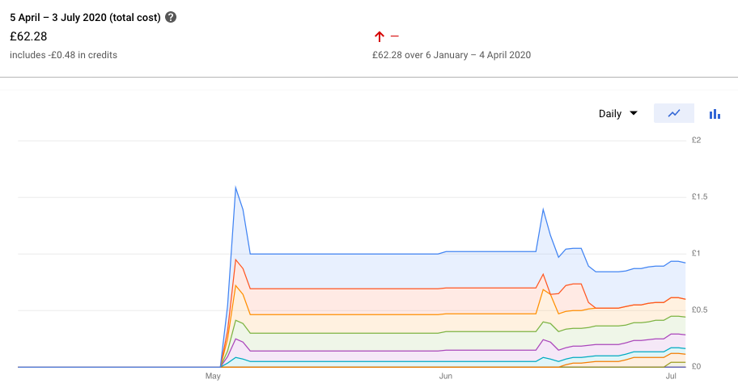

# Running quorum on preemptible GCP instances aka 'consortia ledger on the cheap'

## Intro

Run a cloud hosted 'consortia' style private dlt for less than £50 per month.
The deploymenent is aimed at developers wanting exposure to 'production'
tools & techniques without imposing 'production' costs (time and money)

Inspired by and extending [k8s for cheap on google cloud](https://dev.to/verkkokauppacom/how-to-kubernetes-for-cheap-on-google-cloud-1aei)

What can you do with this ? Operate your own CaaS (Contracts As A Service) ala

* https://medium.com/getamis/sol2proto-694af65ded55
* https://medium.com/getamis/grpc-in-dapp-architecture-8c34125356c7
* https://medium.com/@deeptiman/protobuf-in-hyperledger-fabric-eb674ba9ebd8

By spreading our dlt nodes around a cluster of pre-emptible virtual machines we
can get a reliable service on top of "cheap" un-reliable resources.

Googles cost planner 
* £45 PCM 3x n1-standard-2 pre-emptible  (2x vCPU + 7.5 GB RAM)
* £ 5 PCM 2x f1-micro

Cloud Load balancing with 5 forwarding rules and 8 GB of ingress adds £18 PCM

## What - overview

* quorum deployment with raft consensus, with support for live addition of nodes.
  * raft is convenient and simple and scales 'enough' for development and small
    networks.
  * leave tessera as follow up article.
* wallet keys held in GCP security-manager secrets access controled using GCP
  principals.
* Use of Google Cloud NAT, Workload Identity, Secrets Manager
* kubeip for ingress ip assignment
* envoy as a simple loadbalancer and rate limiter
* traefik for lets encrypt integration and routing to application workloads
* go-ethereum service exposing contract functions as rest endpoints (hello CaaS)
* terraform cloud hosted and git controled cluster configuration.
* All kubernetes workload authorisation using k8s service accounts bound to GCP
  principals using google workload identity
* blob (bucket) storage for dlt configuration (genesis and static-nodes.json)
* skaffold  and kustomize for build/deploy

## Key modifications from referenced 'cheap cluster' article
* use workload identity for all pod auth: kubeip, blob storage, cloud dns01 challenges etc
* use envoy as north south L3/4 proxy (run on hostNetwork rather than traeffic)
* use traeffic with workload idenity and lets encrypt to provide tls 'out of the box'
* use strategy 'replace' for traeffic - rolling update can't possible work with how the node taints are setup

## Deploy the project

There is quite a bit of devops to get through to arive at something that could
form the basis of a production deploy. At the end of this we will be able call,
in a controled way, specific contract functions on our ledger, over the public
internet.  Access will be through a standard looking rest api serverd over tls.
Lets Encrypt will be used for certificates and Envoy will be acting as a
'cheap' load balancer and protecting our workloads from excessive demands.

To get there we need to complete the following

1. Fork [quorumpreempt](https://github.com/robinbryce/quorum-gcp-preemptible)
2. Create Google Cloud Project and configure the service account for use by
   terraform cloud
3. Create a Terraform Cloud project.
4. Create a terraform workspace for the cluster terraform resources and deploy
   the cluster.
5. Create a terraform workspace for the ledger and deploy the ledger resources
6. Install the google cloud tooling needed to generate the node secrets (docker
   image is tbd)
7. Secret Creation - dlt node keys, wallets and other secrets.
8. Bootstrapping (minor search and replace) the kubernetes manififests - its easier this way.
9. Confirm workloads can access the secrets
10. Deploy the kubernets manififests with skaffold

### Terraform Cloud Cluster (steps 1 - 4)

This will give you a cluster defined by terraform files in your git repository.
Commits to that repository will be how you change and update the cluster
infrastructure. This requires a google cloud project, a terraform io account
and a git hub fork of the quorum-gcp-preemptible repository.

The terraform infrastructure is split into cluster and ledger.

cluster defines the single long lived ingress, the pre-emptible instances and
the low level network configuration. A single static ip address is allocated.
The firewall is configured to accept 80, 443 on the static ip.

ledger defines the remaining infrastructure needed to support our dlt nodes,
kubernetes workloads, and public ingress (dns)

Start by forking the
repository

### Google Cloud Project Configuration (step 2)

Sign up for or login to google cloud.

* Create an empty GCP project, set the project id explicitly so that it matches
  the project name (just because it is fewer names to keep track of)
* Enable the compute engine api
* Enable the service usage api (it may be by default)
* Enable Cloud DNS api
* Enable Kubernetes Engine API

All can be found at APIs & Services / API Library

Create an access key on the for terraform cloud for the default service account

Find the Compute Engine default service account. 
IAM & Admin / Service Accounts / Compute Engine Default Service account -> create
key -> create as json save to local disc - it will be stored in the terraform
workspace as a sensitive value (or make your own auth choices)

Grant permission to the default compute engine service account for creating iam
roles and asigning policies. For a development focused setup, simply granting
Editor to the service account is a time saver though there are 

IAM & Admin edit compute engine default sa

For this article the following roles were enabled. There is likely a tighter
set.

Add another role ->
    Editor
        Compute Network Admin
            compute.networks.create
        Compute Security Admin
            compute.firewalls.create
        DNS Administrator
            zone creation
        Kubernetes Engine Viewer,
    Service Account Admin,
    Secret Manager Admin,
    Project IAM Admin,
    Role Administrator

And one more that I can't figure out to grant google_project_service the
permission to create "cloudresourcemanager.googleapis.com"

tip: missing permissions problems use IAM / Roles and filter by permissions to
find out which roles have the permisions.

best intro article
https://cloud.google.com/community/tutorials/getting-started-on-gcp-with-terraform

(pen icon to right)

Create a terraform io account or login.

### Terraform Cloud Workspace Configuration (step 3)

Create a workspace and link it to your fork of the repository.
* Set the name of the workspace. It can be convenient if the cluster workspace
  project matches the gcp project name
* Set the terraform working directory to cluster
* Enable 'only trigger runs when files in specified paths change' (it should
    select the working directory by default)
* Create the workspace

Configure variables

The default region and zone are europe-west2 and europ-west2-a, set
gcp_project_region and gcp_project_zone workspace to override this

* Create the workspace variable gke_project_id and set it to the name of your
  gcp project.
* Add GOOGLE_CLOUD_KEYFILE_JSON as an environment variable

Remove new lines from json key file first

    tr -d '\n' < project-sa-key.json

Go to the Settings
* Ensure execution  mode is remote
* Enable auto apply
* Set terraform 0.12.18 (todo try latest and remove restriction)

In your local checkout of your quorum-gcp-preemptible fork

Edit cluster/terraform.tf and (at least) set the workspace name and the
organsation name. Workspace prefixes may work better if you intend to have many
clusters on the go.

If you need multiple versions of terraform try [tfswitch](https://warrensbox.github.io/terraform-switcher/)

Configure your local terraform cli

Generate an api token in terraform cloud and put it in a credentials block

[api-tokens](https://www.terraform.io/docs/cloud/users-teams-organizations/users.html#api-tokens)
[cli-config](https://www.terraform.io/docs/commands/cli-config.html#credentials)

At this point you could git commit and push and your cluster would stand up. To
be able to validate terraform changes pre commit you need to configure your
local terraform client

Creating a ~/.terraformrc is the simplest if you don't already have
arrangements.

Then do

    terraform init
    terraform plan

Despite the 'local' experience those commands have pushed your local changes to
an isolated remote environment and run them their. The logs are streamed back
to you. This workflow lets you have git be the source of truth for deployed
infrastructure and still have the ability to do some validation pre commit.

If all is well

    git commit -m "initial cluster config"
    git push

The cluster will now create automatically.

### Deploy the ledger cluster resources (step 5)

As before for the cluster workspace
Create a workspace and link it to your fork of the repository.
* Set the name of the workspace. It can be convenient if the ledger workspace
  is related to the cluster workspace name
* Set the terraform working directory to ledger
* Enable 'only trigger runs when files in specified paths change' (it should
    select the working directory by default)
* Create the workspace

Settings
* add a run trigger for the cluster workspace
* others as before

Configure variables

* ingress_domain your.domain.com
* cluster_workspace the workspace of the cluster
* Add (the same) GOOGLE_CLOUD_KEYFILE_JSON as an environment variable

#### note on remote state and outputs being updated

If outputs are added, and no other resources change, you will need to terraform
taint <something> to get the new output variables into the state.

This [issue](https://github.com/hashicorp/terraform/issues/22607) remains open.
Creating a dummy random resource seems to be the work around. Described
[here](https://support.hashicorp.com/hc/en-us/articles/360000958148-Terraform-outputs-fail-to-update-in-Terraform-Enterprise)

### Install the google cloud tooling (step 6)

[interactive sdk installer](https://cloud.google.com/sdk/docs/downloads-interactive)

auth bootstrapping

    gcloud init (to set all the defaults)
    gcloud container clusters get-credentials kluster
    gcloud auth application-default login

With that done do

    cd tools
    python3 -m pip install -r requirements.txt

See [requirements.txt](../tools/requirements.txt) and particularly
* [Python - google-auth](https://pypi.org/project/google-auth/)
* [Python - google-cloud-secret-manager](https://pypi.org/project/google-cloud-secret-manager/)

### Secret creation (step 7)

Terraforms posture on secret data in statefiles is [Short Sighted](https://github.com/hashicorp/terraform/issues/516)
Terraform cloud's posture is [Better](https://www.terraform.io/docs/state/sensitive-data.html) but far from ideal.

With Google Secrets Manger the 'secret' and its 'version' are seperate things.
The 'version' is the current value of the 'secret'. IAM policies are applied to
the 'secret'. So, Use terraform to create the secret but use cli to set the
version version (current value) - that way tf never sees the secret data at all
but we can still use tf to manage the iam's for the secret

But note that the tfstate has credentials to access the whole project so its
still not a complete 'package'. Keys wrapped via Cloud KMS are probably the
'belt and braces' answer but that is not cheap.

Dev guides [Google - Secret Manager](https://cloud.google.com/solutions/secrets-management#tools)

Using with terraform [Terraform and Secret Manager](https://www.sethvargo.com/managing-google-secret-manager-secrets-with-terraform/)

So we _do not_ create the secret with terraform as that exposes the plain text
in the state file.

[secret generation support](../Taskfile.yml)

Run:

    gcloud auth application-default login
    task nodekeys

### Bootstrapping the kubernetes manififests (step 8)

There is NO AVOIDING some kind of templatization - resitance is futile. But
helm and its chart repository model don't suit all use cases. Especially not
rapid developer prototyping: See [argo cd's thoughts](https://blog.argoproj.io/the-state-of-kubernetes-configuration-management-d8b06c1205)

The idea of kustomize is solid, having manifests I can deploy directly is a
*huge* win. But there are always a few details that need substituting. sed and
envsubst are venerable and often completely adequate solutions for *seed*
customization. The get hairy fast when they are embeded in daily workflow.

It is worth sticking with the basic kustomize primitives for as many things as
possible. Their world view is to accomodate clear use cases directly as
transformations of native kubernetes objects. This enables manifest to stay
valid without parameterization. And after an adjustment period, template
variables mostly feel like a bad habbit well gotten rid off. images, image
tags, config maps and even individual fields can all be patched.

But some things that ought to be 'easy' are made 'hard' by the philosophy.
[vars](https://github.com/kubernetes-sigs/kustomize/issues/2052) hasn't worked
out and never really did what people wanted when they found it - a little
templating.

I very much like the idea of *seeding* configuration like this using jsonnet to
generate the initial configuration. [Databricks on jsonnet](https://databricks.com/blog/2017/06/26/declarative-infrastructure-jsonnet-templating-language.html)
has a lot of good insite here.  [go-jsonnet](https://github.com/google/go-jsonnet)

For this project, this would mean we templatize the kustomizations that are
most deplendent on the repository owner: google project name, deployment domain
name. And then generating the repository owner specific kustomizations once on
initial fork/clone.

Bootstraping has an [ancient and venerable](https://www.gnu.org/software/automake/faq/autotools-faq.html#What-does-_002e_002fbootstrap-or-_002e_002fautogen_002esh-do_003f)
 - and not entirely flatering - precedent.

It turns out there is a fairly slick way to combine terraform with kustomize.
The basic approach is to *render* the initial kustomize overlay using
[jsonnet](https://jsonnet.org/learning/tutorial.html). On its own thats just
another templating approach. And there are plenty to choose from already.  What
sets jsonnet appart is how cleanly it integrates with `terraform output -json`

1. Get the terraform output as json

    cd tf/ledger
    terraform output -json ../../k8s/dev-example/ledger.tf.out.json

2. Render the kustomize overlay for *your* terraform output.

    cd k8s/dev-example
    jsonnet -y overlay.jsonnet

The dev-example directory has all the outputs checked in, examine the diff to
see whats changed.

(Minor todo - I need to put the letsencrypt email in a tf output var)

This approach gives us a seeding, retains all the power and clarity of
kustomize manifests but does not require brittle sed/envsubst approaches. Most
importantly the setup instructions are a series of command that require minimal
arguments. And none of those arguments are specific to the deployment.  This
makes the whole thing scriptable *with no input cli arguments at all*

The key files are

* [overlay.sa.jsonnet.TEMPLATE](../k8s/dev-example/overlay.sa.jsonnet.TEMPLATE)
* [overlay.env.jsonnet.TEMPLATE](../k8s/dev-example/overlay.env.jsonnet.TEMPLATE)
* [overlay.jsonnet](../k8s/dev-example/overlay.jsonnet)

Example terraform output -json

* [ledger.tf.out.json](../k8s/dev-example/ledger.tf.out.json)

Which renders

* [overlay.json](../k8s/dev-example/overlay.json)

And kustomize consumes this directly in

* [kustomization.yaml](../k8s/dev-example/kustomization.yaml)

By way of comparison, without *some* templating, to deploy this project on your
own google project you need to:

1. Copy k8s/dev-example to k8s/dev
2. Edit the skaffold.yaml to point kustomize at dev rather than dev-example
3. In all yamls in k8s/dev search and replace `ledger-2` with your own project
4. In all yamls in k8s/dev Search and replace `example.com` with your domain.
5. In quethinit-env-patch.yaml set the value for the BUCKET variable to the 
   cluster_bucket output from your ledger terraform apply

It will problably only take a handful of minutes, and you can commit the
results to your own fork. BUt it is a task that gets old super fast.

* install skaffold
* install kustomize

skaffold run

If everything comes up you are all good.

### Confirm workloads can access the secrets (step 9)

Test workload identity config:

    kubectl run -it \
      --generator=run-pod/v1 \
      --image google/cloud-sdk:slim \
      --serviceaccount quorum-node-sa \
      --namespace queth workload-identity-test

At the prompt enter

    gcloud auth list

You should see

                     Credentialed Accounts
    ACTIVE  ACCOUNT
    *       quorum-node-sa@ledger-2.iam.gserviceaccount.com

But ledger-2 will be replaced by your gcp project name

To set the active account, run:
    $ gcloud config set account `ACCOUNT`

init container with service principal auth to get token.
use curl to get secret via api (replace quorumpreempt with your gcp project name)

    TOKEN=$(curl -s -H 'Metadata-Flavor: Google' http://metadata/computeMetadata/v1/instance/service-accounts/default/token | jq -r .access_token)
    curl "https://secretmanager.googleapis.com/v1/projects/quorumpreempt/secrets/qnode-0-key/versions/1:access" \
        --request "GET" \
        --header "authorization: Bearer ${TOKEN}" \
        --header "content-type: application/json"

Note: DO NOT add

        --header "x-goog-user-project: quorumpreempt"

As this requires an oauth2 token with authenticated *user* identity

We store enode address alongside the key for convenience even though it is not
secret - saves faffing with two different storage providers or having to
re-derive the enode addr

### Confirming public access to the set/add/get contract functions

Using curl

    curl -k -v -d '{"value":2}'  https://queth.ledger-2.felixglasgow.com/adder/v1/set
    curl -k -v -d '{"value":2}'  https://queth.ledger-2.felixglasgow.com/adder/v1/add
    curl -k -v   https://queth.ledger-2.felixglasgow.com/adder/v1/get

Look back up the log to check the TLS

    Server certificate:
     subject: CN=queth.ledger-2.felixglasgow.com
     start date: Jul 18 22:36:34 2020 GMT
     expire date: Oct 16 22:36:34 2020 GMT
     issuer: CN=Fake LE Intermediate X1
     SSL certificate verify result: unable to get local issuer certificate (20), continuing anyway.

In particular, issuer should be Fake LE Intermediate X1 which is the lets
encrypt staging issuer.

It takes a minute or so to issue the cert. While the
challenge is outstanding you will see

    issuer: CN=TRAEFIK DEFAULT CERT

Watch the traefik logs to monitor the progress of the challenge.

You can switch it to the production issuer if you want a valid cert, but note
that rate limits apply. With the current setup traefik will get a new cert
every time the pod dies. Add a persistent volume to fix that. But note that
cert-manager is a more robust (HA) approach - its just not workload identity
aware yet as far as I can tell.

## Ledger node routing

The options for 'cheap' routing of consortum nodes are not great.  Allocating
dns names and ip addresses for every geth node would be expensive and a lot of
work. And there are plenty of guides out there focused on that sort of thing.

Arranging to expose the geth nodes on different ports on the same ip/dns name
is possible. But the resulting configuration isn't very realistic. With
quorum's 2.4.0 release dns names are supported for the nodes declared in the
'static nodes' configuration file. Using dns names to reference the nodes makes
it *look* like a public internet in a lot of places. And that is probably
enough for most realistic personal development scenarious.

TODO:

* static un-assigned ip address are way more expensive than assigned ones.
  kubeip might not be the best solution - but its still only 0.24 cents / day
* just assigning it to the ingress vm instance looks like the same effect and
  a lot less faff

We get a 'custom' [VPC Overview](https://cloud.google.com/vpc/docs/overview)

Point out how bits of the terrafor network configuration map to VPC

Consider Shared VPC for 'genesis' node

VPC Network Peering is the answer for SaaS and inter organisational
collaboration.

Hybrid cloud Cloud VPN is for self hosted *and* on-prem nodes

## Kubernetes Workloads

### Identity and Authorization

We use Google Workload identity to authorise all our kubernetes workloads.
There is no need for explicit mechanisms to deliver secrets, key or
certificants.

* anoyingly, workload-identity is currently incompatible with isio side car
  injection (at least without customisation)
* [Google - Workload Identity](https://cloud.google.com/kubernetes-engine/docs/how-to/workload-identity)

The workspace-identity terraform modules create k8s service accounts with:

    automountServiceAccountToken: false

This is the secure default. pod's can set this explicitly if they need it. The
kubeip pod needs it. Once this is done, worload identity just works. No need
for GOOGLE_APPLICATION_CREDENTIALS or fetching tokens or epxlicitly managing
keys in secrets

Note it turns out that the google sdk client libraries "DefaultClient"
implementation are workload identity aware. Provided other established
mechanisms, such as GOOGLE_APPLICATION_CREDENTIALS, are not configured then it
falls through to just asking the metadata server for a token - at which point
it gets one.

test workload identity config:

    kubectl run -it \
      --generator=run-pod/v1 \
      --image google/cloud-sdk:slim \
      --serviceaccount quorum-node-sa \
      --namespace default workload-identity-test
    gcloud auth list

It will show the kluster-serviceaccount as the active account:

    kubectl run -it --generator=run-pod/v1 --image google/cloud-sdk:slim --serviceaccount quorum-node-sa --namespace default workload-identity-test
    gcloud auth print-identity-token

Get acccess token using curl:

    apt-get update && apt-get install jq -y
    TOKEN=$(curl -s -H 'Metadata-Flavor: Google' http://metadata/computeMetadata/v1/instance/service-accounts/default/token | jq -r .access_token)

Download:

    curl -H "Authorization: Bearer $TOKEN" https://storage.googleapis.com/storage/v1/b/quorumpreempt-cluster.g.buckets.thaumagen.com/o/hello.txt?alt=media

Upload:

    echo "hello workload" > hello.txt
    curl -X POST --data-binary @hello.txt \
        -H "Authorization: Bearer ${TOKEN}" \
        -H "Content-Type: text/plain" \
        "https://storage.googleapis.com/upload/storage/v1/b/quorumpreempt-cluster.g.buckets.thaumagen.com/o?uploadType=media&name=hello.txt"

### Storage for chain nodes

* persistent disc on vm for chain data
* persistent disc on vm for tessera db (anything else is $$$)
* blob storage in bucket for genesis, network membership (static-nodes) and
  node config.

### Resources - Perstent Volumes, StatefulSets, Istio (StatefulSets not really supported)

* [Google Cloud, PersistentVolumeClaim](https://cloud.google.com/kubernetes-engine/docs/concepts/persistent-volumes)
* [Google Cloud, StatefulSet](https://cloud.google.com/kubernetes-engine/docs/concepts/statefulset)

Reclaim policy to retain after claim gone ? [k8s pv reclaim policy](https://kubernetes.io/docs/tasks/administer-cluster/change-pv-reclaim-policy/)
This has to be done by directly modifying the Persistent Voluem *after* it has
been provisioned. See [change reclaim policy on a dynamically provissioned volume](https://kubernetes.io/blog/2017/03/dynamic-provisioning-and-storage-classes-kubernetes/)

> StatefulSets use an ordinal index for the identity and ordering of their
> Pods. By default, StatefulSet Pods are deployed in sequential order and are
> terminated in reverse ordinal order
-- [Google Cloud, StatefulSet](https://cloud.google.com/kubernetes-engine/docs/concepts/statefulset)

Parallel should be fine, although the default OrderedReady may be more
convenient it encourages un-necessary order dpendency.

It may prove tempting to use a Deployment and ReadWriteOnce with a single node.
This isn't a reliable configuration. See [Google - Deployment vs StatefulSets](https://cloud.google.com/kubernetes-engine/docs/concepts/persistent-volumes#deployments_vs_statefulsets)

A StatefulSet with a single replica is the right choice for scenarious where a
single helm deployment equates to a single dlt node.

Without Istio in play, our setup enables use of kubectl scale to dynamicaly
increase the node count.

updateStragety (statefulset)

For RollingUpdate a onfig change starts a new pod. The old pod is only deleted
once the new one is up and ready.

??? If the new pod is re-using the node key of the old this will/will not work ?

For OnDelete, a manual pod deletion triggers a new pod to be created.

??? Individual node key delivery to pods in stateful set ?

Istio users beware, istio has ambigious (at best) support for StatefulSet
applications. In short, if the nodes are *NOT EXTERNALY EXPOSED* then it is
possible to have them 'in mesh' without much trouble. If the are to be routable
accross the open internet, it is still possible, but explicit istio
configuration needs to be created for each scaled instance of the StatefulSet.

If external clients usage is agnostic to which quorum instance they talk
to, it is actually ok to let istio lb the traffict. This works pretty well
until tessera is added - at which point using raw transactions (as go-ethereum
clients do) make things quite hairy. The tx needs to be submited first to
tessera then its hash presented to quorum in a seperate request. There are ways
to make it rare that those request pairs will reach different services but it
will still happen.

And tessera instances MUST be able to reliably reach specific peers else they
will refuse to ACK transactions.

This article on casandra has the key points layed out very well
if using ClusterIP: None (headless) and where only internal routing is required
(No north/south from external sources)

[Cassandra / Istio Article](https://aspenmesh.io/running-stateless-apps-with-service-mesh-kubernetes-cassandra-with-istio-mtls-enabled/)
* Congigure container processes (qurorum) to listen on local host (despite
    recording externaly visible ip/hosts in static-nodes.json)
* REMOVE/DON'T ADD ServiceEntry's or VirtualService definitions
* For ClusterIP: None, the default load balancing mode is PASSTHROUGH

This article covers North/South. Essentially, a manualy, or some how templated,
ServiceEntry, Gateway and VirtualService are required for *each individual pod*
in the statefulset -- this is a problem for using kubectl scale 'on the flye'
[Istio, Headless Services, StatefulSet](https://medium.com/airy-science/making-istio-work-with-kubernetes-statefulset-and-headless-services-d5725c8efcc9)

This will wrap traffic in mTLS. Note that as quorum now supports rpc over tls
this may not be as compelling any more.

[Istio, Headless Services, StatefulSet](https://medium.com/airy-science/making-istio-work-with-kubernetes-statefulset-and-headless-services-d5725c8efcc9)
[Istio ticket statefulset not supported](https://github.com/istio/istio/issues/10659)
[Cassandra / Istio Article](https://aspenmesh.io/running-stateless-apps-with-service-mesh-kubernetes-cassandra-with-istio-mtls-enabled/)

## Ports and IP Assignment

If considering adding istio to the mix, port names matter if deploying on k8s <
1.18. [Istio - Protocol Selection](https://istio.io/latest/docs/ops/configuration/traffic-management/protocol-selection/)

In this article, and for the supporting git hub manifest all ports are named
with this in mind.

All ports are set consistently with the defaults for the workload service. So
8545 is the json-rpc port for qurourms workload. To support routing to multiple
quorum instances in the same cluster from the public internet through a *single
ip* address we shift the port assignments in blocks of 10. So the first node
has all defaults, the second has default + 10 and so on. This is a cost/ease
concession.

When ip addresses are not assigned, the cost 10x more. And for a developer
focused deployment we expect tearing down workloads and leaving the cluster
idle to be the norm. If ips are persistently assigned to vm instances the idle
costs would be acceptable. But then tearing down the cluster would actually
*increase* our costs over an  idle cluster. Idealy we want tearning down the
cluster to reduce our monthly google bill to zero.

We can the use the magic of terraform cloud to stand everything up again in
'cup of coffee' time frame.

## Quorum

Store config in blobs and re-fetch each time. if config is deleted reset all the nodes but keep 'last ditch backups' on the pv.

Fetch secrets to emptyDir every time and symlink into nodedir

side note on running python in quorum's alpine image. Set PYTHONUNBUFFERED=1
else output is missing or delayed

### Genesis

Store in blob. Re-generate if blob missing. If blob missing ignore disk

### Membership

static-nodes.json store in blob

get key from secret store fresh everytime. get static-nodes.json from blob
every time. store in emptyDir. derive enode from key.  If enode not in
static-nodes (from blob) or blob missing re-initialise. move asside any prior
node dir

"Fatal: failed to find local enode ID" is symptomatic of not having the key in
the node dir. In our case, not having fetched it from secrets manager or having
fetched it and then written it to the wrong place or not at all.

Do not attempt to automatically raft.removePeer.

Lets remind ourselves what we can count on from raft.addPeer and also what is
required of us: http://docs.goquorum.com/en/latest/Consensus/raft/raft-rpc-api/

1. raft.addPeer takes an enode address - public address of the nodes key.
2. It errors with an idenfifiable message if the enode is already a member

   > node with this enode has already been added to the cluster

3. If successful it returns the RAFT_ID
4. raft.cluster returns a json document listing all current members and their
   raft ids
6. The initial nodes in the network must be in static-nodes.json and must be
   listed in the same order on each node.
7. There need only be *one* nodes in static-nodes.json
8. Other nodes can be added and removed later without updating
   static-nodes.json if dynamic peer discovery is enabled.
9. To support joining older chains without compromising consensus, nodes should
   join as learner nodes and be promoted once they have synced.

MVP: For now we chose to fully configure the network in static-nodes.json and
distribute the file via a google cloud bucket object.

BETTER:
* one replica set for 'bootnodes' with principal which permits writting
  genesis and static-nodes.json
* one (or more) replica set(s) for participant nodes with a different principal
* All qnode's attempt to update static-nodes.json. Non boot nodes treat 403 as
  "I know you but you are not allowed to do that" and continue. All nodes use
  raft.cluster to check if they are a member and if not will call raft.addPeer

### Accounts

We do not import accounts, except for development cli convenience use. When
using the go-ethereum generated code bindings all transactions are
eth_sendRawTransaction and so are pre signed by the client. The clients keys
are delivered from google secrets manager to the specific workload. Access is
controled by iam permissions.

For development, it is convenient to be able to import and unlock the genesis
accounts. This lets us use node signing and eth_sendTransaction for
experimentation.

### Resilience in the face of pre-empting

Our VM instances *will* get killed at least once per 24hours. Can we use
https://kubernetes.io/docs/concepts/workloads/pods/pod-topology-spread-constraints/

To spread our geth nodes around ?

### google cloud bucket object generation and metageneration

Instead of leasing, googles model is to get the metadata of the object before
the update/write. Then on write, set a precondition match requirement. The
generation changes every time the object changes. The meta-generaiton changes
everytime the object meta data changes. The meta-generation is *reset* when
the object changes and is only meaningfull in combination with a generation
pre-condition

This works very well for read/modify/write where there are no side effects
*other* than the changed bucket content. However, when there are other
side-effects - for example raft registraion - we need some kind of distributed
co-ordination.

Using a bucket which enables the default event-based hold on object creation
gives us "lock on create" semantics.

Can we update and unlock in a single move ? If so we have  a great mechanism
for handling chain membership blob creation and updates.

Ok, possibly not. Can we fix this with 'co-operative rules'

removing a hold is allowed in only 2 scenarios:

* Service just created object
* Service placed hold on object in its current 'session'

If we crash
* Service has 'tombstone' enabling it to un hold after crashing with hold

But how to store the 'tombstones' without recursive problem

How about combining event-based with temporary, event-based to solve the
creation-lock problem and time-based to get lease like behaviour ?

No, event-based and temporary holds work the same when no retention policy is
set.

ok,

* pre join - get/create held blob with member details 'sans' raft id. this can only
  succeede once. try getting first.
* join - create 'held' blob for member, content addressed by key, with raft id in
  `join' is not allowed to release the hold.

### IP's and/or DNS names for quorum nodes

Historically, geth nodes have always required static ip addresses. This seems
to be due to the use of [Kademlia](https://en.wikipedia.org/wiki/Kademlia) in
ethereum. It certainly offers no identification benefit - nodes all have
pub/priv keys.

Now, quorum offers [dns support](http://docs.goquorum.com/en/latest/Quorum%20Features/dns/)

We still need at least one public IP if the nodes are to be routable accross
the open internet (we may not want that).

Can we combined dns names with SNI so we don't have to differentiate nodes
using port numbers ?

https://cloud.google.com/storage/docs/object-holds

### Kubernetes & Headless (StatefulSet) services

[A/AAAA for headles services](https://kubernetes.io/docs/concepts/services-networking/dns-pod-service/#a-aaaa-records)
resolve to *sets of ip addresses*

To allow for nodes to connect accross the open internet in the 'standard' gcp
way there are 3 options listed here

[GCP Preparting for Prod/Connecting to External Services](https://cloud.google.com/solutions/prep-kubernetes-engine-for-prod#connecting_from_inside_a_cluster_to_external_services)
1. stub domains - forward some dns names to external dns.
2. external name services - if the need is to map a few records back to
   existing dns services
3. services without selectors - most flexible but highest maintenance cost.

CubeDNS + GCP articles point towards in-cluster "self-service" dns

* gke means kube-dns unless willing to do [significant special config](https://medium.com/google-cloud/using-coredns-on-gke-3973598ab561)
* [CoreDNS/Fabric Orderer](https://medium.com/google-cloud/coredns-afaa732aa35e)

[Kubernetes dns-pod-service](https://kubernetes.io/docs/concepts/services-networking/dns-pod-service/)

firewall rule from reference article only open 80, 443
By default, firewall rules restrict cluster master to only initiate TCP connections to nodes on ports 443 (HTTPS) and 10250 (kubelet)

## Starting point for Contracts As A Service (CaaS)

adder 'getsetadd.sol' and go-ethereum based grpc wrapper service Hello 'CaaS'.

* [getsetadd.sol](../adder/getsetadd.sol)
* [main.go](../adder/service/main.go)
* [adder.proto](../adder/api/adder/v1/adder.proto)
* [Taskfile.yml](../adder/Taskfile.yml)

For deeper examples and tooling for Contracts As A Service see:

* https://medium.com/getamis/sol2proto-694af65ded55
* https://medium.com/getamis/grpc-in-dapp-architecture-8c34125356c7
* https://medium.com/@deeptiman/protobuf-in-hyperledger-fabric-eb674ba9ebd8

brew install grpcurl
k9s port-forward access to the adder pod

use of protset output with [grpcurl](https://github.com/fullstorydev/grpcurl)

    grpcurl --plaintext -protoset ./adder.protset \
        -d '{"value":"1"}' localhost:9091 adder.v1.Adder.Set

response is like

    {
      "data": {
        "nonce": 41,
        "to": "I4L4/AZj6NB+HO2ZHBpoWJUY6H4=",
        "payload": "YP5HsQAAAAAAAAAAAAAAAAAAAAAAAAAAAAAAAAAAAAAAADEK",
        "v": "HA==",
        "r": "D7bWbsTFV8BqR2YG4iVsR117TNZRENXchjgbs9lILCw=",
        "s": "dpKEG12rtsIqu/lSOSCJBEXBJWFcC8NQKpvAvdg5gJY="
      },
    }

Get tx hash as hex

    grpcurl --plaintext -protoset ./adder.protset \
        -d '{"value":"1"}' localhost:9091 adder.v1.Adder.Add \
        | jq -r .hash | base64 -D  | hexdump -v -e '/1 "%02x"'

Get the current value

    grpcurl --plaintext -protoset ./adder.protset localhost:9091 \
        adder.v1.Adder.Get | jq -r .value | base64 -D
    2

## North/South Envoy+Traefik bridge with TLS & Lets Encrypt

There are loads of good in depth articles on this. Here we just make some
choices that fit with our goal of a cost and time efficient developer oriented
deployment.

We go with dns01 challenges from the start. They support wild carded dns and
are, despite appearances, simpler to arrange.

Traefik can do all the lets encrypt challenges directly. The community instance
can only do this if we run are running a single instance of Traefik. The
communinty edition does not support Lets Encrypt in a HA scenario. The EE paid
version [does](https://containo.us/pricing/). Cert-Manager can be [made to
work](https://docs.traefik.io/providers/kubernetes-crd/) with the communinty
edition if both traeffic (free) and HA are desired

Cert-Manager's google cloud dns provider does not support workload identity. It
requires a secret with a [service account
key](https://cert-manager.io/docs/configuration/acme/dns01/google/). This is
precisely what we wanted to move a way from in using workload identity

And finaly, not having cert-manager is one less piece to configure. So we opt
to stick with the singleton traeffic instance

This [guide](https://docs.traefik.io/user-guides/crd-acme/) is pretty much all
we need We make one change, we use a service account bound to our workload
identity. In order to get the access token and client tls cert for kubernetes
api access to work we *must* set

    automountServiceAccountToken: true

Just after we set

    serviceAccountName: dns01solver-sa

In the deployment.yaml for traefik

For "googleapi: Error 403: Forbidden" errors which fail the challenge. First
check that the workload idenity is correct. Get a shell on the traffic pod
using k9s. And then issue

curl -s -H 'Metadata-Flavor: Google' http://metadata/computeMetadata/v1/instance/service-accounts/default/identity?audience=whatever

Drop the result in to https://jwt.io. Check that the "sub"field matches the
Unique ID of the service account you are using for the dns01solver. A likely
problem if workload identity isn't being applied is that it is the identity of
the default node identity.

Similarly, you can eliminate traefik/lets encrypt config by first checking, in
the same shell, that you can list the managed zones.

    TOKEN=$(curl -s -H 'Metadata-Flavor: Google' http://metadata/computeMetadata/v1/instance/service-accounts/default/token | jq .access_token -r)
    curl  -H "Authorization: Bearer $TOKEN" https://dns.googleapis.com/dns/v1/projects/quorumpreempt/managedZones

If this doesn't work from the shel in the workload, no amount of traefik config
wrangling is going to help. On your development host, if gcloud is setup and
configured, you can get the bearer token for your owner account with 

    gcloud auth print-access-token

If you then replace TOKEN above with the new one and try again it should work.
This confirms its a cluster IAM permissions issue

This [issue](https://github.com/jetstack/cert-manager/issues/2069#issuecomment-531428320) appears to be relevant to traefik as it is about google cloud not liking email reuse
so if there is trial and error, or switching back and forth between
cert-manager and traefik that issue may be to blame

To further diagnose traefik's namespace and workload identity, create a pod in
the traefik node space. This will require use of --overrides to work around the
taints

    kubectl run -it --generator=run-pod/v1 --image google/cloud-sdk:slim \
        --serviceaccount dns01solver-sa --namespace traefik \
        --overrides '{"apiVersion":"v1","spec":{"template":{"spec":{"tolerations":[{"effect":"NoExecute","key":"ingress-pool","operator":"Equal","value":"true"}]}}}}' wli-test

At the prompt enter

    gcloud auth print-identity-token

This is the equivelant curl

    curl -s -H 'Metadata-Flavor: Google' http://metadata/computeMetadata/v1/instance/service-accounts/default/identity

The various gcloud tools are now available to help workout what is wrong

So it turns out that workload identity can not work on pods which run on the
host network

> Workload Identity can't be used with pods running on the host network.
> Request made from these pods to the Metadata APIs will be routed to the
> Compute Engine Metadata Server.

And also,

> The GKE Metadata Server takes a few seconds to start to run on a newly
> created pod. Therefore, attempts to authenticate or authorize using
> Workload Identity made within the first few seconds of a pod's life may
> fail. Retrying the call will resolve the problem.

And our base article configures traefik to bind to the host network as the
ingress/static ip sans loadbalancer solution. Nuts

> There's a couple key things in our traefik deployment that sets it apart
> from our other deployments. First is [hostNetwork](https://github.com/nkoson/gke-tutorial/blob/master/k8s/traefik/deployment.yaml#L22) which we need for
> traefik to listen on network interfaces of its host machine.

Lets review the [GKE/kubip situation](https://blog.doit-intl.com/kubeip-automatically-assign-external-static-ips-to-your-gke-nodes-for-easier-whitelisting-without-2068eb9c14cd)

Some facts:

1. hostNetwork is not compatible with workload identity
2. traefik can not proxy ssl. it has to terminate it. - ah but
   [traefik 2 can](https://containo.us/blog/traefik-2-tls-101-23b4fbee81f1/)
3. cert-manager does not support workload identity direclty
4. a custom dns solver for cert manager is way to much work look
   [here](https://github.com/jetstack/cert-manager-webhook-example) if you
   fancy that. For a HA setup it may be worth the effort
5. envoy *can* proxy ssl, and as an L3/4 tcp proxy is pretty simple to
   configure statically.
6. envoy appears to be significantly more efficient https://containo.us/blog/traefik-2-tls-101-23b4fbee81f1/

Traefik is easy and as we already have it wins on the 'time efficient' front. [tls passthrough](https://containo.us/blog/traefik-2-tls-101-23b4fbee81f1/) (see the end of that article)

But envoy as a 'fancy stunnel' to headless Traefik is quite a compeling idea
for a simple north/south bridge. So lets try running a lean envoy proxy on a host
network with ssl pass through and Traefik as the incluster router & tls terminator.

Making our Traefik 'headles' an using envoy with a strict_dns is described at
[use-envoy-as-loadbalancer-in-kubernetes](https://blog.markvincze.com/how-to-use-envoy-as-a-load-balancer-in-kubernetes/)

A nice backround article on [modern-network-load-balancing](https://blog.envoyproxy.io/introduction-to-modern-network-load-balancing-and-proxying-a57f6ff80236)

The final traefik-web setup is

* [service.yaml](../k8s/traefik/service.yaml)
* [deployment.yaml](../k8s/traefik/deployment.yaml)

With envoy looking like this

* [envoy-north/configmap.yaml](../k8s/envoy-north/configmap.yaml)
* [envoy-north/development.yaml](../k8s/envoy-north/development.yaml)

TODO(tls/letsencrypt)

* [ ] do we need to declare the k8s namespaces used by workload identities to
      terrarform ? seems so. OR if it already exists in the cluster it 'just
      works'. But without spliting the tf into two, that is a bootstraping
      issue.
* [ ] tls & cert manager|traefik ingress to public ip
* [ ] work out why the custom minimaly privileged role for the dns01 challenge
      did not work.
* [ ] what is the correct storage for acme-staging.json 

TODO:

* [x] standup vanila pod with pvc
* [x] deliver nodekey to pod using workload identity
* [x] deliver wallet key to pod using workload identity
* [x] do gensis
* [x] sort out node routing ip/dns.
* [x] do member add
* [x] qnodeinit.py init command which does both genesis and nodeinit
* [x] get/set/add with tx response in api for adder service example
* [x] check depeloyed code (getCode (addr) ) against runtime code
* [ ] Headless + deployment alternate as per https://kubernetes.io/docs/tasks/run-application/run-single-instance-stateful-application/
* [ ] follow the pattern from [here](https://github.com/getamis/grpc-contract/blob/master/examples/cmd/server/main.go)
* [ ] node affinity to spread the dlt nodes around for preempt resilience
      for contract deployment (this looks dependent on k8s' 1.18 which is a bit
      fresh)
* [ ] run quorum as daeomon set, with taints to keep them off the ingress. it
      is a simple way to spread but forces us to have 1 VM per geth node
* [x] caas example using
  * https://medium.com/getamis/sol2proto-694af65ded55
  * https://medium.com/getamis/grpc-in-dapp-architecture-8c34125356c7
  * https://medium.com/@deeptiman/protobuf-in-hyperledger-fabric-eb674ba9ebd8
* [x] premise and outline to marta
* [ ] account convenience script for unlocking and using our genesis funded
      accounts.
* [ ] https://github.com/miguelmota/ethereum-development-with-go-book
* [ ] skaffold profile patch to set replica count
* [ ] consider curl + jq for quorum main image so we can put nodekey in
      emptyDir
* [ ] ? store pods configuration in blob object named after its public key
* [ ] in cloud builds
* [x] rename qnodeinit.py to raftnode.py or qraft.py or something 'rafty'
* [x] probably rename qnode -> quorum. called it queth.

## Article Resources

* Inspired by [k8s for cheap on google cloud](https://dev.to/verkkokauppacom/how-to-kubernetes-for-cheap-on-google-cloud-1aei)
* Ah, this looks interesting https://medium.com/getamis/sol2proto-694af65ded55 (Contract As A Service - CaaS )
